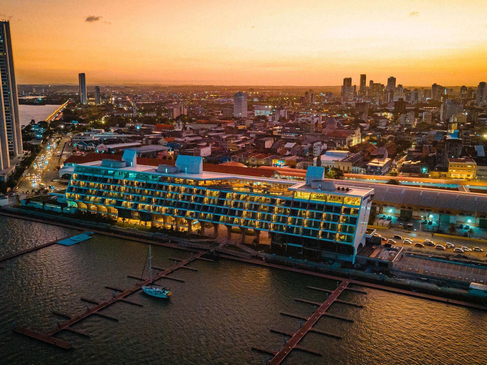
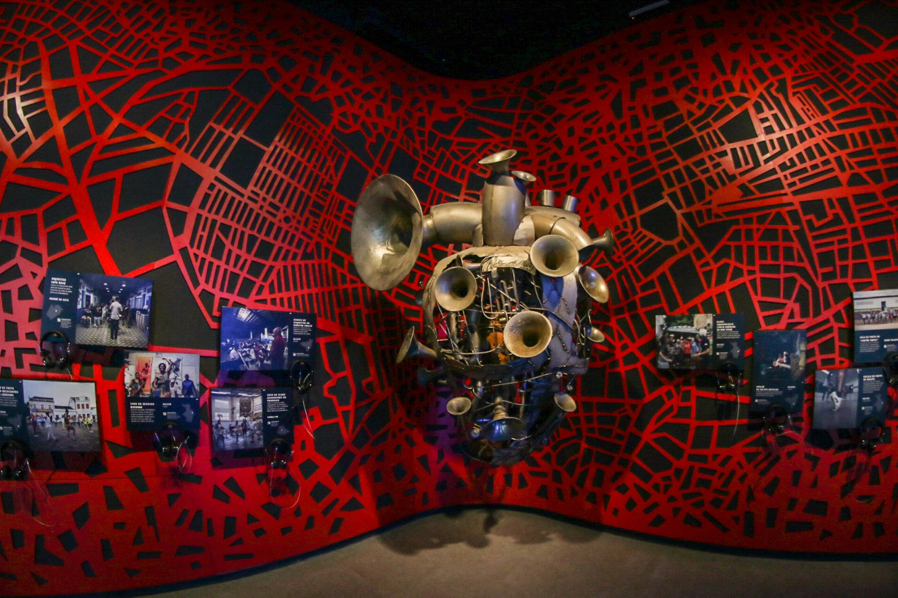
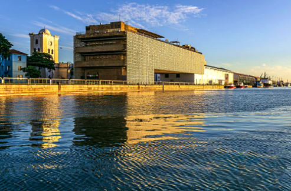

# 🌎 Explore Recife App

<p align="center">
  
  
  
</p>

O **Explore Recife** é um aplicativo Android nativo desenvolvido para proporcionar uma experiência imersiva de turismo na "Veneza Brasileira". Com um design moderno, fluido e focado no usuário, o app permite descobrir pontos turísticos, hotéis e centros culturais com detalhes ricos e navegação intuitiva.

---

### 🚀 Funcionalidades Principais

*   ✅ **Tela de Welcome Imersiva:** Experiência visual de impacto com a famosa frase de Cícero Dias.
*   ✅ **Home Page Dinâmica:** Navegação por categorias (Localização, Passeios, Comida, Arte).
*   ✅ **Seções Curadas:** Listagem de destinos "Populares" e "Recomendados".
*   ✅ **Detalhes Enriquecidos:** Informações completas sobre cada local, incluindo preços, avaliações e facilidades personalizadas.
*   ✅ **Navegação Type-Safety:** Uso de Navigation Compose para transições seguras entre telas.
*   ✅ **Layout Edge-to-Edge:** Aproveitamento total da tela do dispositivo para uma estética premium.

---

### 🏗️ Arquitetura e Organização

O projeto segue princípios de desenvolvimento moderno com **Jetpack Compose**, organizado de forma modular para facilitar a manutenção:

```text
br.com.treinamento.navegacaofluxotelas
├── model/           # Modelos de dados e Mock Data
├── navigation/      # Grafo de navegação e rotas
├── ui/
│   ├── screens/     # Telas do aplicativo (Welcome, Home, Detail)
│   └── theme/       # Definições de cores, tipografia e temas
└── MainActivity.kt  # Ponto de entrada com NavHost
```

---

### 🛠️ Tecnologias Utilizadas

| Categoria | Tecnologia | Versão |
| :--- | :--- | :--- |
| **Linguagem** | Kotlin | 2.2.10 |
| **UI Framework** | Jetpack Compose | 2026.02.01 (BOM) |
| **Navigation** | Navigation Compose | 2.8.8 |
| **Icons** | Material Icons Extended | - |
| **Mínimo SDK** | API 24 (Android 7.0) | - |
| **Target SDK** | API 37 (Android 15) | - |

---

### 📸 Screenshots do Projeto

O app possui 5 telas principais que cobrem todo o fluxo do usuário:

<p align="center">
  
  
  
  
  
</p>

1.  **Welcome:** Boas-vindas com foco em Recife.
2.  **Home:** O hub de exploração.
3.  **Detail - Novotel:** Foco em hospedagem.
4.  **Detail - Paço do Frevo:** Foco em cultura e dança.
5.  **Detail - Cinema São Luiz:** Foco em história e arte.

---

### ⚙️ Execução e Configuração

**Pré-requisitos:** Android Studio Ladybug ou superior e Java 17+.

1.  **Clonar o repositório:**
    ```bash
    git clone https://github.com/ItaloRochaj/navigation-flow-project.git
    ```
2.  **Sincronizar o Gradle:** Abra o projeto no Android Studio e aguarde a conclusão do Gradle Sync.
3.  **Executar:** Selecione um emulador ou dispositivo físico e clique em `Run`.

---

### 💡 Facilidades Personalizadas por Local

Diferente de apps comuns, o **Explore Recife** adapta as informações exibidas de acordo com o destino:
*   **Cais do Sertão:** Inclui facilidades como "fones" e "exposição".
*   **Paço do Frevo:** Destaca "cafeteria" e "museu".
*   **Cinema São Luiz:** Exibe "bilheteria" e "filmes".
*   **Esculturas:** Apresenta "barco", "passeio" e "mar".

---

**Autor:** Italo Rocha (@ItaloRochaj)  
**Versão:** 1.0.0 (Julho de 2026)
